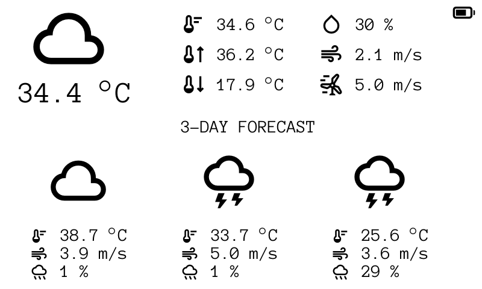
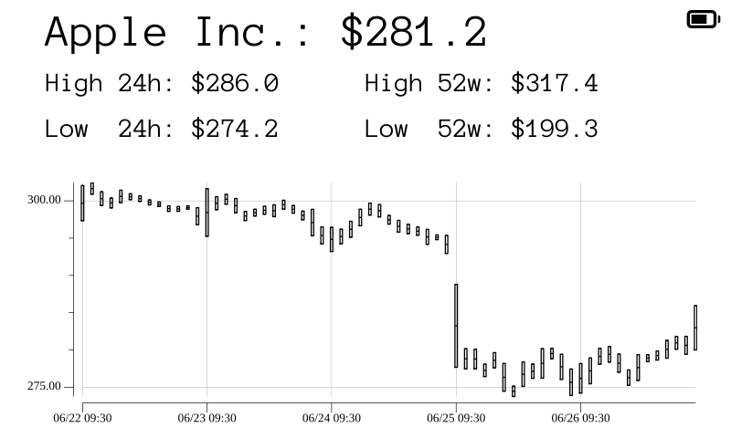
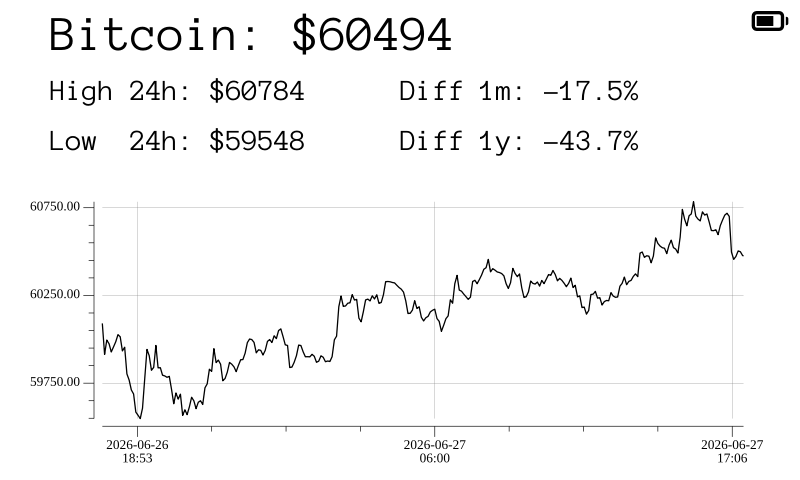

# TRMNL Server Go

A self-hosted backend for [TRMNL](https://usetrmnl.com/) e-ink display devices (800×480).
It's a single binary self-hosted server without any additional dependencies (except of course fetching data). 
You can run it either as binary or docker container on your local machine or router. 

## Features

- **Built-in plugins**
  - `weather` — current conditions and forecast (Open-Meteo, no API key)
  - `twelvedata` — 7-day stock OHLC chart (TwelveData, Free API key required)
  - `coingecko` — 24h crypto price chart (CoinGecko, no API key)
- **Self-contained** — SQLite for storage, no external database or message broker
- **Auto-provisioned assets** — fonts and icons (both from Google Fonts) are downloaded on first run and cached locally
- **Auto-plugin rotation** — each device cycles through the plugins you enable

## Example screens

Each enabled plugin renders an 800×480 screen for the device. Here's what the built-in plugins produce:

| Weather | Stocks (TwelveData) | Crypto (CoinGecko) |
|:---:|:---:|:---:|
|  |  |  |

## Requirements

- Go **1.26** or newer
- A host reachable by your devices over the network (typically a LAN IP)
- Outbound internet access for plugin APIs and Google Fonts (text fonts and Material Symbols icons)

## Quickstart

## Run with Docker

Prebuilt multi-arch images (**amd64** + **arm64**) are published to Docker Hub as
[`stvasyl/trmnl-server-go`](https://hub.docker.com/r/stvasyl/trmnl-server-go).

### Quick run from Docker Hub

```bash
# 1. Create your config
cp example/config.yaml config.yaml
# Edit config.yaml — set common.external_url to your host's LAN IP, e.g. 192.168.1.50:8080

# 2. Run the latest image
# either with docker-compose
docker-compose -f docker-compose.yml up -d

# or with docker run
docker run -d \
  --name trmnl-server \
  --restart unless-stopped \
  -p 8080:8080 \
  -v trmnl-data:/data \
  -v "$(pwd)/config.yaml:/config/config.yaml:ro" \
  stvasyl/trmnl-server-go:latest
```

### Notes

- **Persistence** — all runtime state (the SQLite DB, rendered PNGs, and the cached fonts/icons) lives in
  the named volume `trmnl-data`, so device registrations survive restarts and rebuilds.
- **Config** — `config.yaml` is bind-mounted read-only at `/config/config.yaml`; API keys are never baked
  into the image. Edit the file and restart the container to apply changes.
- **Ports** — the container listens on `8080`. Keep `port:` in your config, the port in `external_url`, and
  the published port in agreement.
- **Health** — the container reports health via the `/healthz` endpoint.


## Build

```bash
# 1. Create your config from the template
cp example/config.yaml config.yaml

# 2. Edit config.yaml — at minimum set common.external_url (see below)

# 3. Run it
make run          # or: go run main.go
```

To build a standalone binary instead:

```bash
make build
./trmnl-server-go
```

On first run the server creates these in the working directory:

| Path        | Contents                                          |
|-------------|---------------------------------------------------|
| `public/`   | Rendered screen PNGs served to devices            |
| `fonts/`    | Cached TTF downloaded from Google Fonts            |
| `icons/`    | Cached Material Symbols icon font (Google Fonts)   |
| `trmnl.db`  | SQLite database (devices, screen state, voltage)   |

By default the server reads `config.yaml` from the working directory. Pass `-c <path>` to use a different
config file:

```bash
go run main.go -c /etc/trmnl/config.yaml   # or: ./server -c /etc/trmnl/config.yaml
```

## Configuration

All settings live in `config.yaml`. Start from `example/config.yaml`.

### `common`

| Key               | Type       | Description                                                                 |
|-------------------|------------|-----------------------------------------------------------------------------|
| `external_url`    | string     | Host:port devices use to download images. **Must be reachable by the device** — it is embedded in the image URLs the server returns. |
| `port`            | int        | Port the server listens on.                                                 |
| `dbpath`          | string     | Path to the SQLite database file.                                           |
| `refresh_time`    | int        | Seconds between device display refreshes.                                   |
| `update_time`     | int        | Seconds between background data refreshes (how often plugins re-fetch).     |
| `debug`           | bool       | Enables debug-level logging.                                                |
| `enabled_plugins` | list       | Plugins to activate, in rotation order (e.g. `["weather", "twelvedata"]`).  |
| `font_name`       | string     | Any Google Fonts family name (defaults to `Anonymous Pro`).                 |

> **`external_url` is the setting people most often get wrong.** It must be the address a physical device
> can reach (e.g. `192.168.1.1:8080`), not `localhost`.

### `plugins`

Only the plugins you list in `enabled_plugins` need a config block.

| Plugin       | Key                  | Description                              |
|--------------|----------------------|------------------------------------------|
| `twelvedata` | `symbols`            | Ticker symbols, e.g. `["googl", "nvda"]`.|
| `coingecko`  | `symbols`            | Coin IDs, e.g. `["bitcoin"]`.            |
| `weather`    | `location`           | City name, e.g. `Wroclaw`.               |

Example:

```yaml
common:
  external_url: "192.168.0.1:8080"
  port: 8080
  dbpath: "./trmnl.db"
  refresh_time: 300
  update_time: 3600
  debug: false
  font_name: "Anonymous Pro"
  enabled_plugins: ["weather", "twelvedata", "coingecko"]

plugins:
  twelvedata:
    twelvedata_api_key: demo
    symbols: ["AAPL"]
  coingecko:
    symbols: ["bitcoin"]
  weather:
    location: Kyiv
```

## Connecting a TRMNL device

This server works perfectly fine with the TRMNL open firmware [trmnl-firmware](https://github.com/usetrmnl/trmnl-firmware)

Point your device's custom server URL at this server's `external_url`. The device then:

1. Calls `/api/setup` with headers `Access-Token`, `Id`, and `Battery-Voltage`. The server registers the
   device and returns a setup response.
2. Polls `/api/display` on the device's own refresh interval. The server replies with the current screen's
   image URL (under `external_url`/`public/`) and advances the rotation to the next enabled plugin.
3. Downloads and displays the PNG, then repeats.

Meanwhile a background worker re-renders every plugin's screen every `update_time` seconds, so the images
devices fetch are always reasonably fresh.

## HTTP endpoints

| Method | Path           | Purpose                                                      |
|--------|----------------|-------------------------------------------------------------|
| GET    | `/healthz`     | Health check.                                               |
| —      | `/api/setup`   | Device registration; returns the setup payload.            |
| —      | `/api/display` | Returns the current screen image URL and rotates screens.  |
| POST   | `/api/log`     | Ingests device logs.                                        |
| GET    | `/public/`     | Serves the rendered PNG files.                              |

## Make targets

| Command         | Action                                              |
|-----------------|-----------------------------------------------------|
| `make run`      | Run the server with `go run`.                       |
| `make build`    | Build the `./server` binary.                        |
| `make test`     | Run all tests with coverage.                        |
| `make coverage` | Run tests and open the HTML coverage report.        |
| `make clean`    | Remove the binary and coverage output.              |

## Troubleshooting

- **After registering NEW device it can't load images** - Restart the server. Auto update plugins data after registering new device is on TODO. 
- **Device shows nothing / can't load images** — `external_url` is almost always the cause. Confirm it's the
  host:port the device can actually reach, that `port` matches, and that no firewall blocks it.
- **Screens render but icons are missing** — icons are rendered from the Material Symbols font, downloaded
  from Google Fonts on first use and cached in `icons/`. If the host has no internet on first run, icons are
  skipped (text still renders); they appear once connectivity returns and the cache fills.
- **Server exits on startup with a font error** — the font is fetched from Google Fonts; check connectivity
  or set `font_name` to a valid Google Fonts family.
- **A plugin shows stale or empty data** — check the plugin's API key/symbols and look at the logs. Set
  `debug: true` for verbose output; device-side logs arrive via `POST /api/log`.
