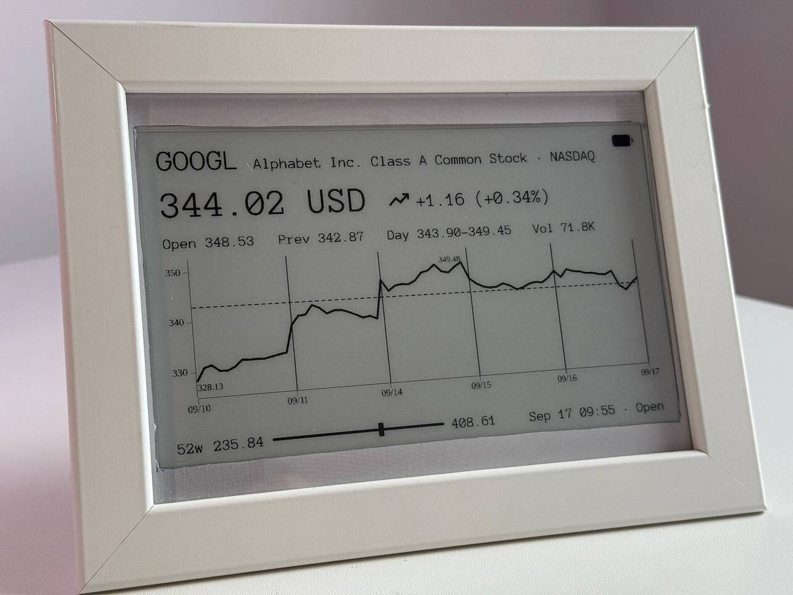
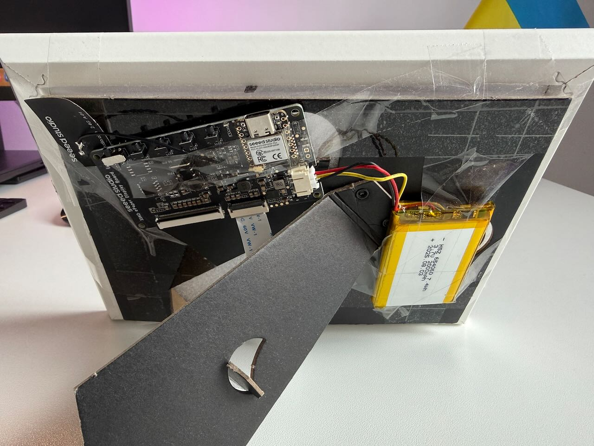
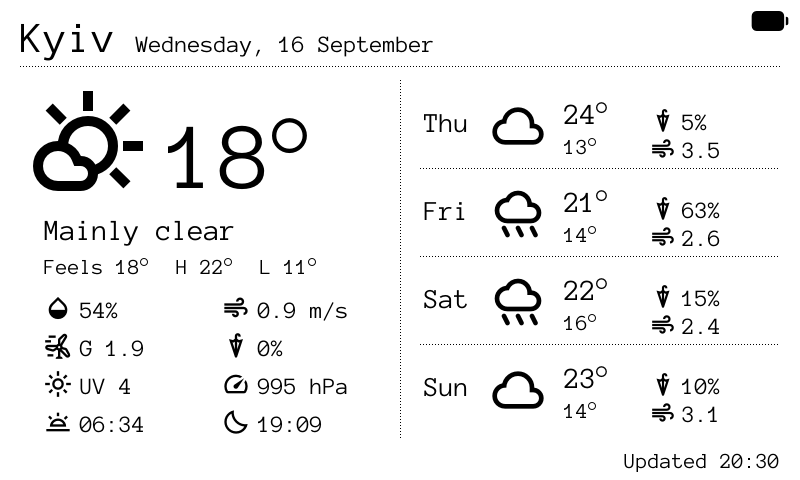
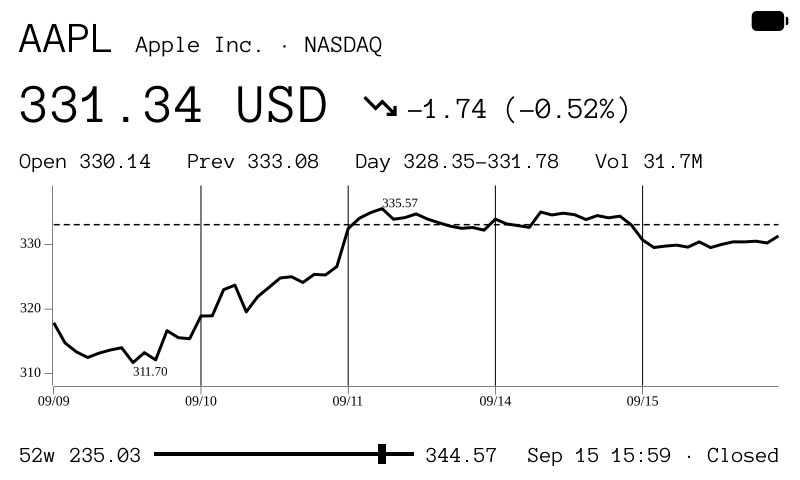
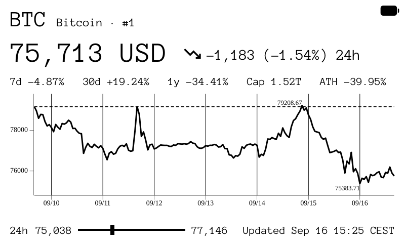
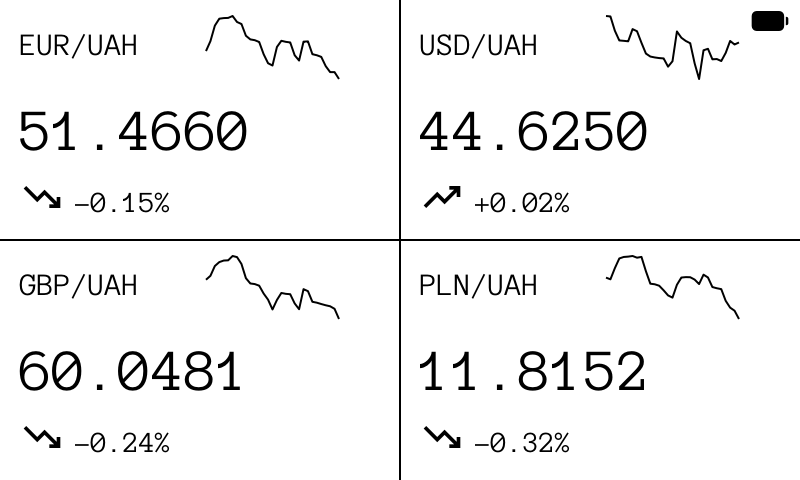
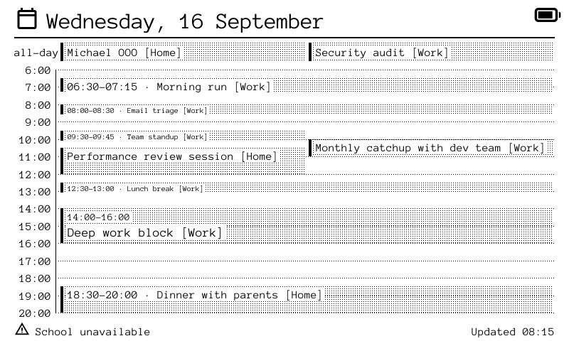

# TRMNL Server Go

A self-hosted backend for [TRMNL](https://usetrmnl.com/) e-ink display devices (800×480).
It's a single binary self-hosted server without any additional dependencies (except of course fetching data). 
You can run it either as binary or docker container on your local machine, Raspberry Pi or even router if you have ssh access.

**Important**: At this moment only devices with resolution 800×480 and trmnl open source firmware are supported.

## Features

- **Built-in plugins**
  - `weather` — current conditions and forecast (Open-Meteo, no API key)
  - `twelvedata` — stock quote with change, day and 52-week range, and a 7-day close-price chart (TwelveData, Free API key required)
  - `coingecko` — crypto quote with 24h change, market cap and ATH distance, and a 7-day price chart (CoinGecko, no API key)
  - `currency` — exchange rates, 4 pairs per screen with daily change and 30-day trend (Frankfurter, 165 currencies including UAH, no API key)
  - `calendar` — today's agenda merged from any number of iCalendar feeds: Apple/iCloud public calendar links, Google Calendar secret addresses, Outlook, Nextcloud or any `.ics` URL (no API key, no OAuth)
  - `custom` — images rendered by anything else (Home Assistant, Grafana, a script): each configured PNG or JPEG URL becomes its own screen, downloaded once per update
- **Self-contained** — SQLite for storage, no external database or message broker
- **Auto-provisioned assets** — fonts and icons (both from Google Fonts) are downloaded on first run and cached locally
- **Auto-plugin rotation** — each device cycles through the plugins you enable

## My setup

I have ordered my Speedstudio XIAO TRMNL 7.5' DIY kit from [Aliexpress](https://aliexpress.com/item/1005009532501677.html) with the photoframe from IKEA (probably when I buy a 3d printer I'll update photos with new case instead of this ugly FrankeinFrame). Using [TRMNL Flasher](https://trmnl.com/flash) I have upgraded the device firmware to the 1.8.10 version via browser. 

| Front | Back |
|:---:|:---:|
|  |  |

## Example screens

Each enabled plugin renders an 800×480 screen for the device. Here's what the built-in plugins produce:

| Weather | Stocks (TwelveData) | Crypto (CoinGecko) | Currency (Frankfurter) | Calendar (ICS feeds) |
|:---:|:---:|:---:|:---:|:---:|
|  |  |  |  |  |

## Requirements

- Go **1.26** or newer
- A host reachable by your devices over the network (typically a LAN IP)
- Outbound internet access for plugin APIs and Google Fonts (text fonts and Material Symbols icons)

## Quickstart

## Run with Docker

Prebuilt multi-arch images (**amd64** + **arm64**) are published to Docker Hub as
[`stvasyl/trmnl-server-go`](https://hub.docker.com/r/stvasyl/trmnl-server-go).

### Quick run from Docker Hub

```bash
# 1. Create your config
cp example/config.yaml config.yaml
# Edit config.yaml — set common.external_url to your host's LAN IP, e.g. 192.168.1.50:8080

# 2. Run the latest image
# either with docker-compose
docker-compose -f docker-compose.yml up -d

# or with docker run
docker run -d \
  --name trmnl-server \
  --restart unless-stopped \
  -p 8080:8080 \
  -v trmnl-data:/data \
  -v "$(pwd)/config.yaml:/config/config.yaml:ro" \
  stvasyl/trmnl-server-go:latest
```

### Notes

- **Persistence** — all runtime state (the SQLite DB, rendered PNGs, and the cached fonts/icons) lives in
  the named volume `trmnl-data`, so device registrations survive restarts and rebuilds.
- **Config** — `config.yaml` is bind-mounted read-only at `/config/config.yaml`; API keys are never baked
  into the image. Edit the file and restart the container to apply changes.
- **Ports** — the container listens on `8080`. Keep `port:` in your config, the port in `external_url`, and
  the published port in agreement.
- **Health** — the container reports health via the `/healthz` endpoint.


## Build

```bash
# 1. Create your config from the template
cp example/config.yaml config.yaml

# 2. Edit config.yaml — at minimum set common.external_url (see below)

# 3. Run it
make run          # or: go run main.go
```

To build a standalone binary instead:

```bash
make build
./trmnl-server-go
```

On first run the server creates these in the working directory:

| Path        | Contents                                          |
|-------------|---------------------------------------------------|
| `public/`   | Rendered screen PNGs served to devices            |
| `fonts/`    | Cached TTF downloaded from Google Fonts            |
| `icons/`    | Cached Material Symbols icon font (Google Fonts)   |
| `trmnl.db`  | SQLite database (devices, screen state, voltage)   |

By default the server reads `config.yaml` from the working directory. Pass `-c <path>` to use a different
config file:

```bash
go run main.go -c /etc/trmnl/config.yaml   # or: ./server -c /etc/trmnl/config.yaml
```

## Configuration

All settings live in `config.yaml`. Start from `example/config.yaml`.

### `common`

| Key               | Type       | Description                                                                 |
|-------------------|------------|-----------------------------------------------------------------------------|
| `external_url`    | string     | Host:port devices use to download images. **Must be reachable by the device** — it is embedded in the image URLs the server returns. |
| `port`            | int        | Port the server listens on.                                                 |
| `dbpath`          | string     | Path to the SQLite database file.                                           |
| `refresh_time`    | int        | Seconds between device display refreshes.                                   |
| `update_time`     | int        | Seconds between background data refreshes (how often plugins re-fetch).     |
| `debug`           | bool       | Enables debug-level logging.                                                |
| `enabled_plugins` | list       | Plugins to activate, in rotation order (e.g. `["weather", "twelvedata"]`).  |
| `font_name`       | string     | Any Google Fonts family name (defaults to `Anonymous Pro`).                 |

> **`external_url` is the setting people most often get wrong.** It must be the address a physical device
> can reach (e.g. `192.168.1.1:8080`), not `localhost`.

### `plugins`

Only the plugins you list in `enabled_plugins` need a config block.

| Plugin       | Key                  | Description                              |
|--------------|----------------------|------------------------------------------|
| `twelvedata` | `symbols`            | Ticker symbols, e.g. `["googl", "nvda"]`.|
| `coingecko`  | `symbols`            | Coin IDs, e.g. `["bitcoin"]`.            |
| `weather`    | `location`, `temperature_unit`, `wind_speed_unit` | City name, e.g. `Kyiv`. Optional `temperature_unit` is `celsius` (default) or `fahrenheit`; optional `wind_speed_unit` is `ms` (default), `kmh`, `mph` or `kn`. An unknown unit stops the server at startup. |
| `currency`   | `screens`            | List of screens, each with `pairs` of 1–4 currency pairs like `EUR/UAH`. Screens rotate as `currency_1`, `currency_2`, … |
| `calendar`   | `timezone`, `layout`, `calendars` | IANA zone that defines "today" (e.g. `Europe/Kyiv`; defaults to the server's local zone), the screen `layout` (`timeline`, the default hour grid, or `list`, one row per event) and a list of feeds, each with a `name` (shown as a tag) and an ICS `url` (`https://` or `webcal://`). |
| `custom`     | `urls`               | List of `http://` or `https://` URLs of ready-made PNG or JPEG images. Each becomes one screen, rotating as `custom_1`, `custom_2`, … in list order. |

Currency pairs read as "1 unit of the first currency in the second", so `EUR/UAH` shows how many UAH one EUR buys.
Rates come from the Frankfurter v2 API, which blends about a hundred central banks into daily rates for 165
currencies, so codes the ECB never published (UAH, GEL, KZT, …) work too. An unknown code or more than four pairs
on a screen stops the server at startup with a clear error.

#### Calendar feeds

The calendar plugin subscribes to read-only iCalendar (`.ics`) feeds, so it needs no OAuth flow or API key. Every
configured feed is merged into one screen for the current day, each event tagged with its calendar name when more
than one feed is configured. Recurring events, moved or cancelled occurrences, multi-day and overnight events, and
feeds in other time zones are all handled. Invitations you declined are left out (Google keeps them in the feed
but hides them in its own UI), and symbols the text font cannot draw, such as emoji, are dropped from titles.

Two layouts are available. `timeline` (the default) draws the day as an hour grid fitted to the day's events
(never narrower than 8 hours; 07:00–19:00 on an empty day), with an all-day strip on top and overlapping events
placed side by side. Short meetings keep a readable block and nudge the next one down a few pixels rather than
shrinking. `list` shows one row per event, all-day events first, which fits more on a very busy day.

- **Apple / iCloud** — in Calendar on a Mac, right-click the calendar → *Sharing Settings…* → tick *Public Calendar*
  and copy the `webcal://` link (on iPhone: *Calendars* → ⓘ next to the calendar → *Public Calendar*). Paste it
  as-is; the server rewrites `webcal://` to `https://`. Only iCloud calendars you own can be published.
- **Google Calendar** — on calendar.google.com open *Settings*, pick the calendar, scroll to *Integrate calendar*
  and copy the *Secret address in iCal format*. Workspace admins can disable this address; personal accounts
  always have it.
- **Anything else** — Outlook.com, Fastmail, Nextcloud, Proton and most other services publish an ICS URL too.

Two things to know:

- **Freshness is set by the provider, not by `update_time`.** Google in particular caches the secret feed on its
  side, so an event added a few minutes ago can take a while to show up.
- **Anyone holding a feed URL can read that calendar.** Treat `config.yaml` as you treat API keys. A leaked Google
  address can be reset from the same settings page, and an Apple calendar can be un-published.

Set `timezone` to your IANA zone. Without it the plugin uses the server's local zone, which inside Docker is UTC
unless you pass `-e TZ=Europe/Kyiv` (or similar). A feed that fails to download is named in the screen's footer
while the other feeds still render; the screen is skipped only when every feed fails.

#### Custom images

The `custom` plugin is the escape hatch for anything this server does not render itself. Let another system
prepare the screen (Home Assistant, Grafana, a cron job with ImageMagick, a tiny script) and publish it as a
PNG or JPEG at a URL; list the URLs here and each one becomes a screen in the rotation.

- **Make the image 800×480.** That size is copied pixel for pixel. Anything else is scaled to fit, keeping its
  aspect ratio, and centered on white, which is fine for a quick test but blurs text.
- **Keep the top-right 40×40 px clear.** The battery icon is stamped there, as on every other screen.
- **Use black and white.** The panel is 1-bit, so gray tones and colour are thresholded by the device. Dither
  photos before publishing them.
- **Downloads are cached for one minute.** Every device shares one download per update, and the next background
  update (`update_time`) always fetches a fresh copy. Downloads time out after 30 seconds and are capped at 16 MB.
- **A failed download keeps the last image.** If the URL is unreachable or does not decode, the previous PNG stays
  on disk and the error is logged; nothing is rendered blank. A brand-new device with no previous image gets a 404
  and retries on its next refresh.

Example:

```yaml
common:
  external_url: "192.168.0.1:8080"
  port: 8080
  dbpath: "./trmnl.db"
  refresh_time: 300
  update_time: 3600
  debug: false
  font_name: "Anonymous Pro"
  enabled_plugins: ["weather", "twelvedata", "coingecko", "currency"]

plugins:
  twelvedata:
    twelvedata_api_key: demo
    symbols: ["AAPL"]
  coingecko:
    symbols: ["bitcoin"]
  weather:
    location: Kyiv
    temperature_unit: celsius   # or fahrenheit
    wind_speed_unit: ms         # or kmh, mph, kn
  currency:
    screens:
      - pairs: ["EUR/UAH", "USD/UAH", "GBP/UAH", "PLN/UAH"]
      - pairs: ["EUR/USD", "GBP/USD", "USD/JPY", "USD/CHF"]
  # Add "calendar" to enabled_plugins once the feed URLs below are your own.
  calendar:
    timezone: "Europe/Kyiv"
    layout: "timeline"   # or "list"
    calendars:
      - name: "Work"
        url: "https://calendar.google.com/calendar/ical/<calendar-id>/private-<key>/basic.ics"
      - name: "Family"
        url: "webcal://p44-caldav.icloud.com/published/2/<token>"
  # Add "custom" to enabled_plugins to show images rendered elsewhere (800×480 PNG or JPEG).
  custom:
    urls:
      - "http://homeassistant.local:8123/local/trmnl/dashboard.png"
      - "https://grafana.example.com/render/d-solo/abc?width=800&height=480"
```

## Connecting a TRMNL device

This server works perfectly fine with the TRMNL open firmware [trmnl-firmware](https://github.com/usetrmnl/trmnl-firmware)

Point your device's custom server URL at this server's `external_url`. The device then:

1. Calls `/api/setup` with headers `Access-Token`, `Id`, and `Battery-Voltage`. The server registers the
   device and returns a setup response.
2. Polls `/api/display` on the device's own refresh interval. The server replies with the current screen's
   image URL (under `external_url`/`public/`) and advances the rotation to the next enabled plugin.
3. Downloads and displays the PNG, then repeats.

Meanwhile a background worker re-renders every plugin's screen every `update_time` seconds, so the images
devices fetch are always reasonably fresh.

## HTTP endpoints

| Method | Path           | Purpose                                                      |
|--------|----------------|-------------------------------------------------------------|
| GET    | `/healthz`     | Health check.                                               |
| —      | `/api/setup`   | Device registration; returns the setup payload.            |
| —      | `/api/display` | Returns the current screen image URL and rotates screens.  |
| POST   | `/api/log`     | Ingests device logs.                                        |
| GET    | `/public/`     | Serves the rendered PNG files.                              |

## Make targets

| Command         | Action                                              |
|-----------------|-----------------------------------------------------|
| `make run`      | Run the server with `go run`.                       |
| `make build`    | Build the `./server` binary.                        |
| `make test`     | Run all tests with coverage.                        |
| `make coverage` | Run tests and open the HTML coverage report.        |
| `make clean`    | Remove the binary and coverage output.              |

## Troubleshooting

- **Device shows nothing / can't load images** — `external_url` is almost always the cause. Confirm it's the
  host:port the device can actually reach, that `port` matches, and that no firewall blocks it.
- **Screens render but icons are missing** — icons are rendered from the Material Symbols font, downloaded
  from Google Fonts on first use and cached in `icons/`. If the host has no internet on first run, icons are
  skipped (text still renders); they appear once connectivity returns and the cache fills.
- **Server exits on startup with a font error** — the font is fetched from Google Fonts; check connectivity
  or set `font_name` to a valid Google Fonts family.
- **A plugin shows stale or empty data** — check the plugin's API key/symbols and look at the logs. Set
  `debug: true` for verbose output; device-side logs arrive via `POST /api/log`.
- **Calendar screen says "<name> unavailable"** — that feed URL returned an error. Check it opens in a browser
  (for Apple links, replace `webcal://` with `https://`) and that the calendar is still shared. Events on the
  wrong day usually mean `timezone` is unset and the server runs in UTC.
